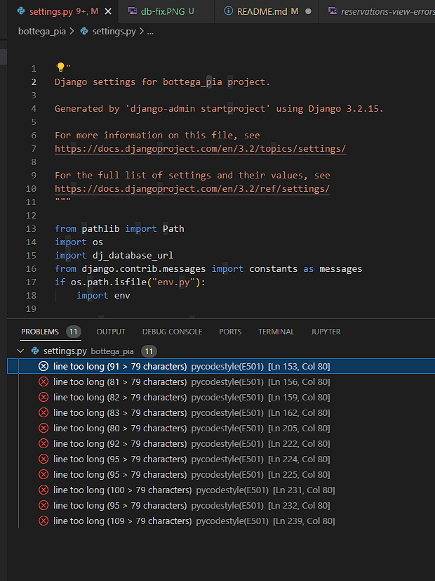

# Bottega Pia

This is a full-stack frameworks project built using Django, Python, HTML, CSS and JavaScript. This is a restaurant website designed to display menus to customers & allow them to make/edit/delete reservations. It is based of a real Italian resturant that serves great food. This project has been built for educational purpose.

[Live application can be found here](https://bottegapia.herokuapp.com/)

# Table of Contents
- [Bottega Pia](#bottega-pia)
- [Table of Contents](#table-of-contents)
  - [User Experience](#user-experience)
  - [User Stories](#user-stories)
  - [Scope](#scope)
  - [Structure](#structure)
    - [Databases](#databases)
      - [Menus](#menus)
      - [Reservations](#reservations)
  - [Skeleton](#skeleton)
  - [Surface](#surface)
  - [Features](#features)
    - [Current Features](#current-features)
    - [Home page](#home-page)
      - [Menus - Food \& Drinks](#menus---food--drinks)
      - [Reservations](#reservations-1)
      - [Contact Form](#contact-form)
  - [Technology Used](#technology-used)
  - [Testing](#testing)
    - [Code Validation](#code-validation)
    - [Manual Testing](#manual-testing)
    - [Automated Testing](#automated-testing)
    - [Bugs and Fixes](#bugs-and-fixes)
  - [Deployment](#deployment)
    - [Creating an Application with Heroku](#creating-an-application-with-heroku)
      - [Heroku](#heroku)
      - [ElephantSQl](#elephantsql)
      - [Heroku Deployment](#heroku-deployment)
  - [Credits](#credits)
  - [Acknowledgements](#acknowledgements)

## User Experience
Using the core UX principles I first started with Strategy, thinking about the target audience for this restaurant & the features they would benefit from.

The target audience for 'Bottega Pia' are:
- People that like real Italian food.
- People that enjoy eating out.
  
These users will be looking for:
- An informative website, with information that is easy-to-find & concise
- Current & up-to-date menus, with essential information such as price, allergens and dietary info
- A booking form to make reservation enquiries with the restaurant
- A way to contact the restaurant
- The ability to make a user account to manage their reservations

This website will offer all of these things whilst also allowing for intuitive navigation and comfortability of use. 

Due to the accessibility of mobile phones, it is assumed that most users will be viewing the site on their mobile phones and therefore creating something responsive is integral to the design, I have used Bootstrap elements & custom CSS to allow for this.

## User Stories
Please find all my defined user stories & their acceptance criteria [here](https://github.com/users/ExcellentWish/projects/4)

1. As a user I can intuitively navigate through the site so that I can view desired content.
2. As a user I can get key information about the restaurant from the landing page so that I can spend less time having to search for information.
3. As an admin user I can log in so that I can access the site's backend.
4. As an admin user I can approve or reject any reservation requests so that I can manage the restaurant's bookings efficiently.
5. As an admin user I can sign in to add & remove items from the current menus so that I can make sure the website is up to date and accurately reflects what is being served in the restaurant.
6. As an admin user I can create, remove, update or delete food & drinks items from the database so that I can ensure items are accurate and able to be added to the menu on the website.
7. As a user I can register or log in so that I can manage my booking requests.
8. As a user I can easily see if I'm logged in or not so that I can choose to log in or log out depending on what I'm doing.
9. As a user I am prompted to register for an account so that I can create an account and receive the benefits from having a profile.
10. As a user I can log in so that I can auto-populate forms with my information on the site.
11. As a user I can view the food & drinks menu's separately so that I can easily find the information I'm looking for.
12. As a user I can easily find all of the relevant information about the menu items so that I can make informed decisions.
13. As a user I can submit a reservation request so that I can visit the restaurant.
14. As an admin user I can prevent guests from submitting reservation requests for full slots so that I can efficiently manage customer expectations and prevent a backlog of bookings.
15. As a user I can find a navigation bar and footer so that I can see what content there is on the website.
16. As a user I can send a contact form to the restaurant so that I can receive additional information.
17. As a logged-in customer I can edit/delete an existing enquiry so that I can make changes if required online.
18. As a user I can edit my customer information so that I can make sure my details are up to date for any future communication with the restaurant.
    
## Scope
In order to acheuve the desired user & business goals the following features will be included in this release:

- Responsive navbar that will navigate to the various pages throughout the site
- Landing page with brief information about the restaurant and links to the menu and reservations page
- Menus page, with links to food & drinks menu respectively
- Reservations page, with booking form to enquire with the restaurant
- Register/login feature using Django allauth
- Contact form using Google SMTP

## Structure
This website has been designed with simplicity in mind, each page only have entirely relevant information on it so that the user is able to find what they want quickly without having to read through unnessecary things. I have seperated out each key feature to really highlight their functionality to the user.

The website is made of three apps:
1. Website - core functionality
2. Menus - menu display
3. Reservations - reservations enquiries & customer management

### Databases
The menus and reservations app both require databases to store information so I have built custom models.

#### Menus
FoodItem & DrinksItem are the model names for the menus app, these are two standalone models that provide all of the information required to display the items as part of the restaurant's menu. Each item has a name, description, price, dietary

#### Reservations
There are 3 models in this app, Customer, Table & Reservation. The combination of these 3 models allow for customer details to be stored, reservation enquiries to be made & managed & also enable availability checks whilst the user is enquiring.

For each reservation, there will be a customer & table assigned to it. The customer is assigned during the enquiry process and the tables are assigned in the backend by the admin user. This works for users that are logged in and also those that aren't. Logged in users will have their details associated with the user email address as this is how they are located in the customer model.

The tables model is also used to determine what the availability of the restaurant is like and this logic prevents bookings from being made if there are no tables available at the specified date and time.

Database scheme for the menus

## Skeleton
[Wireframes can be viewed here](assets/documents/wireframes/WIREFRAMES.md)

The theme of simplicity follows through to the design, I've used bootstrap columns and rows to divide the pages and tried to keep the same layout throughout so that the user has a sense of ease when on the various pages. 

## Surface
Initially, the colour pallete I have chosen for this website are from [coolers.co](https://coolors.co/5d737e-fdf7f7-64b6ac-e85d75-c76d7e).

I like it because it has the Italian flag colours in it. I wanted a 'clean' feel and based it on greens to keep in theme with Italy. Italy will have a huge role in the design of the restaurant and the menu so I wanted there to be consistency.

However during the development decided to go with a darker green for better contrast throughout the page.

I chose the fonts Exo and Roboto I wanted a bold/statement font to use for headings which is why I chose 'Exo' and then 'Roboto' for the general content as it's easier to read for the user.

## Features

### Current Features
### Home page
**Navigation bar**: The navigation bar has links to all the active pages for the user and are clearly labelled, the menus option has a dropdown link to take the user to the Food or Drink menu. The page that the user is on has an 'active' style, the background changes to white and the text turns green to indicate to the user which page they're on. The same style change also happens when a nav link is hovered on to again clearly indicate to the user what they are about to click on. 

If the user is logged in then the right side of the menu shows links for pages that only authorised users can visit & use, they are: 'Manage Reservations', 'Update Details' & 'Logout'. Otherwise, the user will be given the option to 'Register' or 'Login'. This change in the menu ensures users are directed to pages they can use, preventing any frustration and also prompting the user to sign up for an account. Furthermore, it makes it abundantly clear what the logged-in status is to the user. 
 

The navigation bar is fully responsive and collapses on mobile screens to a hamburger icon, this easily allows the user to continue to use the navigation links without the need to press back on the browser.

- **Menus and Reservations images with link**: These images and titles are both clickable and will take the user to the menus or reservations page.
  

- **Footer**: The footer displays some of the restaurants key information and has links to social media(There is no social pages for the resturant). It is split into three sections, 'Opening Times', 'Find us! & 'Keep in touch'.
  

I felt that having all three sections displayed on a mobile screen made the footer too long so I chose to hide the map using a JavaScript function

#### Menus - Food & Drinks

- **Seperate menus**: Each page displays all sections of the menus seperately, each menu item has the Dish/Drink name, dish/drink description, price, dietary information & any allergens. The menus are controlled by the admin user, if 'on menu' is selected in the admin panel then the item will be displayed.

I have chosen to display the menus on different pages so that the user is able to find the information they want as easily as possible, this separation prevents information overload as the pages aren't full of multiple menus.
 

#### Reservations
- **Reservation form**: This page consists of the customer & reservation model forms, they are displayed together to appear as one to make it simple for the user.

If the user is logged in and they exist in the customer model then their name & email address are pre-populated, this has been done in an effort to improve their overall experience

If they are not yet in the customer model then only their email address is added using the email from their user account.

If the user is not logged in at all then the form appears blank, as the form requires the phone number to be entered in the +353 format I have added this placeholder to the phone number input field to try and help the user.

**Manage Reservations**:Logged in users are able to view the 'manage reservations' page, on this page they are shown any reservation enquiries they have previously made using the email address associated with their user account.

The reservation ID is displayed at the top of the reservation item so they can be easily identified, the reservation status is also given a coloured background, depending on what the status is, to give the user a visual representation of this status.

There are also edit & delete buttons, users are able to edit or delete existing reservations they have that are either 'confirmed' or 'pending'.

This image was taken while testing. I realised that my manage reservation pages where dull as I forgot to add styling to them.

I decided that reservations with a date in the past would display with a status of 'expired' and would not be able to be edited as this could cause confusion for the user and also the admin user. They are able to be deleted, as for a user would not like having expired reservation left there page.

Defensive programme has been used to prevent users editing/deleting reservations that they aren't meant to, if a user tried (by adding the reservation ID in the URL) they would be redirected back to manage reservations.

**Edit Reservation**: This page simply displays the reservation form pre-populated using the reservation instance, the user is able to change the date, time or number of guests and resubmit the form. After resubmitting the user is redirected back to the 'Manage Reservations' page and a success message is displayed showing which reservation was edited. 

**Delete Reservations**: This page simply displays the reservation selected with all of its information, the user presses 'Cancel Reservation' and a modal pop's up for the user to confirm the cancellation, explaining that this cannot be undone. If the user chooses 'Yes delete' the reservation will be deleted from the model. After confirming the user is redirected back to the 'Manage Reservations' page and a success message is displayed showing which reservation was edited. 

**Update customer details**: A logged-in user can also update their phone number or full name that is stored in the customer model, this can be done from the 'Update Details' link in the navbar. This page simply displays the customer form but has the email address blanked out - this is because the email is associated with the user account and so I want the user to change their email for their account.

There are explanation statements on this page regarding the email address as the user is only able to view reservations made under the users 'primary' email. I added this statement so that users were not surprised if they weren't able to view reservations made under an old email address. 

If a user wants to update their email address they can navigate using the link found on 'Update Details'. They are taken to `accounts/email` and from here they can manage the emails associated with their user account. They can also switch their 'Primary' email to view reservations associated with their other email.

#### Contact Form
- **Contact form**:All users are able to submit a contact form from the 'Contact Us' page, this sends an email to the website owner using Google SMTP. Having a way to communicate with the website owner/restaurant manager is a helpful tool for the user and creates a platform for communication to strengthen the relationships with customers.

This form also pre-populates with the customer's information if they're logged in.

## Technology Used
I have used several technologies that have enabled this design to work:
- [Django](https://www.djangoproject.com/)
    - Django is the framework that has been used to build the over project and it's apps.
- [Python](https://www.python.org/)
    - Python is the core programming language used to write all of the code in this application to make it fully functional.
- [Bootstrap](https://getbootstrap.com/docs/5.2/getting-started/introduction/)
    - For help with HTML and CSS layout 
- [Google Fonts](https://fonts.google.com/)
    - Used to obtain the fonts linked in the header, fonts used were Playfair and Cookie
- [Font Awesome](https://fontawesome.com/)
    - Used to obtain the icons used on the high scores and rules pages.
- [Google Developer Tools](https://developers.google.com/web/tools/chrome-devtools)
    - Used as a primary method of fixing spacing issues, finding bugs, and testing responsiveness across the project.
- [GitHub](https://github.com/)
    - Used to store code for the project after being pushed.
- [Git](https://git-scm.com/)
- [Cloudinary](https://cloudinary.com/)
    - For media storage
- [Balsamiq](https://balsamiq.com/)
  - For wireframes and flow charts
- [Pycodestyle](https://pypi.org/project/pycodestyle/)
  - Used to test my code for any issues or errors.
- [Heroku](https://www.heroku.com/)
    - For Deployment of this website
- [Color Contrast Accessibility Validator](https://color.a11y.com/)
    - To help test colours I will use
- [Coolers] (https://coolors.co)
    - To help find colours to use
- [W3C Markup Validation Service](https://validator.w3.org/) 
    - Used to validate all HTML code written and used in this webpage.
- [W3C CSS Validation Service](https://jigsaw.w3.org/css-validator/#validate_by_input)
    - Used to validate all CSS code written and used in this webpage.
- [Freeformatter CSS Beautify](https://www.freeformatter.com/css-beautifier.html)
    - Used to accurately format my CSS code.
- [Freeformatter HTML Formatter](https://www.freeformatter.com/html-formatter.html)
    - Used to accurately format my HTML code.
- [AmIResponsive](http://ami.responsivedesign.is/)
    - Used to generate responsive image used in README file.
- [Image Resizer](https://imageresizer.com/)
    - Used to help improve Lighthouse score.

## Testing
I have used a combination of manual and automated testing to ensure the website's functionality meets the desired intent.

### Code Validation
All of my code has been validated using an online validator for specific languages, and pycodestyle for python as PEP8online.com was down.

- [W3C Markup Validation Service](https://validator.w3.org/) 
    - Used to validate all HTML code written and used in this webpage.
    - 
    - 
  
  
- [W3C CSS Validation Service](https://jigsaw.w3.org/css-validator/#validate_by_input)
    - Used to validate all CSS code written and used in this webpage.

- [JSHint](https://jshint.com/)
    - Used to validate JS code
  
  
    - Some variables not showing as I used Jquery.
  
- With PEP8Online.com down I used Pycodestyle.

 -  [Pycodestyle](https://pypi.org/project/pycodestyle/) 
 -  To use PEP8 Standard in my code.
 -  For my reservation views
 -  
 -  To this:
 -  
  
  I had PEP8 problems in my modal
  - 
  - And fixed it to this:
  - 
  
  Also in reservation URLs
  - 
  - And fixed
  -  

The problem I have is with setting.py but after speaking with my mentor and he explained it was legacy code and that old terminals only had the 79 characters long view, he put my mind at ease.
If its good for Django its good for me.
- 

### Manual Testing

I have tested this project manually myself and have also had it peer-reviewed & tested by friends and family on multiple devices and screen sizes.
Testing document is found [here](TESTING.md)

### Automated Testing

I have used the Coverage library throughout testing to keep track of how much of my Python code was covered by the tests I had written. From running the coverage report my website has 66% of my code tested. The remaining code is covered by manual testing.

To generate your own coverage report from the command line:

1. Install the package using `pip3 install coverage`
2. Run `coverage run manage.py test`
3. Then `coverage html` to generate the report
4. You can view the report in a browser by using the command `python3 -m http.server` and opening the `index.html` file from inside the `htmlcov` folder.

### Bugs and Fixes
- At various stages of my testing, upon submitting the contact form some users received a 500 error, this was due to Gmail preventing my application from logging in. I would receive an email to alert me of this login attempt and so I have had to enable these permissions a handful of times in order for it to work.
  
- Issue with database in bottega_pia Settings.py. When deploying to Heroku I would get 500 errors. I believe this was due to `DEVELOPMENT = True`. I had this in my configuration in config vars in Heroku.

My fix was to comment out my code for `Development`

After further review, it was due to the changing of databases, where I had similar usernames but different passwords

- Images in index.html where side by side in mobile. Used bootstrap classes to have images go below one another for a better UX.
  
- Using Lighthouse reports
  
- Using lighthouse reports I resized my images to increase my score.
  

Although Desktops were an easy fix, mobile was not.
- It went form this
 
- To this
  

## Deployment
To deploy my django application, I used [Code Institute Full Template](https://github.com/Code-Institute-Org/gitpod-full-template)
- Click the `Use This Template` button.
- Add a repository name and brief description. 

### Creating an Application with Heroku
I followed the below steps using the Code Institute tutorial and [Django Blog cheatsheat](https://docs.google.com/document/d/1P5CWvS5cYalkQOLeQiijpSViDPogtKM7ZGyqK-yehhQ/edit)
The following command in the Gitpod CLI will create the relevant files needed for Heroku to install your project dependencies `pip3 freeze --local > requirements.txt`. 

1. Go to Heroku.com and log in; if you do not already have an account then you will need to create one.
2. Click the New dropdown and select Create New App.
3. Enter a name for your new project, all Heroku apps need to have a unique name, you will be prompted if you need to change it.
4. Select the region you are working in.
  
#### Heroku 
- Heroku changed there policy for free database on their website. Below I have a section for ElephantSQL.
- When it was free this is what you would do.
    - In the resources tab you must install 'Heroku Postgres' in the add-ons section
    - You can set it to hobby for free use.

You will need to set your Environment Variables - this is a key step to ensuring your application is deployed properly.
- In the Settings tab, click on `Reveal Config Vars` and set the following variables:
    - Add key: `PORT` & value `8000`
    - SECRET_KEY - to be set to your chosen key
    - CLOUDINARY_URL - to be set to your cloudinary API environment varible
    - DATABASE_URL - Using ElephantSQL
    - DISABLE_COLLECTSTATIC, 1 - Untill its ready for release

#### ElephantSQl
- For this project I used ElephantSQL for the database, as Heroku changed there policy for use of their free database.
- Log in or create an account with [ElephantSQL.com]([ElephantSQL.com](https://www.elephantsql.com/)) to access your dashboard.
- Click `Create New Instance`. A green button on the right side of the page.
- Set up your plan
    - Give your plan a `Name` (this is commonly the name of the project)
    - Select the `Tiny Turtle` (Free) plan
    - You can leave the Tags field blank
- Select a data center near you.
    - For this I used `EU-west-1(Ireland` 
- Then click `Review`
- Check your details are correct and then click `Create instance`
- Return to the ElephantSQL dashboard and click on the `database instance name` for your project
- In the URL section, click the copy icon to copy the `database URL`
- Copy to heroku `Reveal Config Vars`
  
#### Heroku Deployment

In the Deploy tab:
1. Connect your Heroku account to your Github Repository following these steps:
2. Click on the `Deploy` tab and choose `Github-Connect to Github`.
3. Enter the GitHub repository name and click on `Search`.
4. Choose the correct repository for your application and click on `Connect`.
5. You can then choose to deploy the project manually or automatically, automatic deployment will generate a new application every time you push a change to Github, whereas manual deployment requires you to push the `Deploy Branch` button whenever you want a change made.
6. Once you have chosen your deployment method and have clicked `Deploy Branch` your application will be built and you should see the below `View` button, click this to open your application:

## Credits

- https://startbootstrap.com/theme/agency helped with header
- https://docs.djangoproject.com/en/4.1/ For help with using Django
- https://github.com/pennersr/django-allauth For user functions on the website
- https://jqueryui.com/ For script.js throughout the project
- https://www.youtube.com/watch?v=TZL-WFzvDJg For google SMTP
- https://www.youtube.com/watch?v=llbtoQTt4qw from Kasia Bogucka that help with this project and help me understand Django alot.
- Matt Rudge for his Django I think therefore I blog and resume project at [Code Institute](https://codeinstitute.net)
- https://colorlib.com/ for my 500 and 404 pages

## Acknowledgements

I would like to thank my course mentor Ronan McClelland for his support and guidance throughout the course of the project and Kasia Bogucka and my peers from Msletb slack group for their support & feedback. Code Institute Slack channels for a massive resources of information and help.