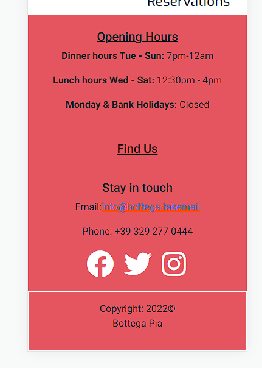
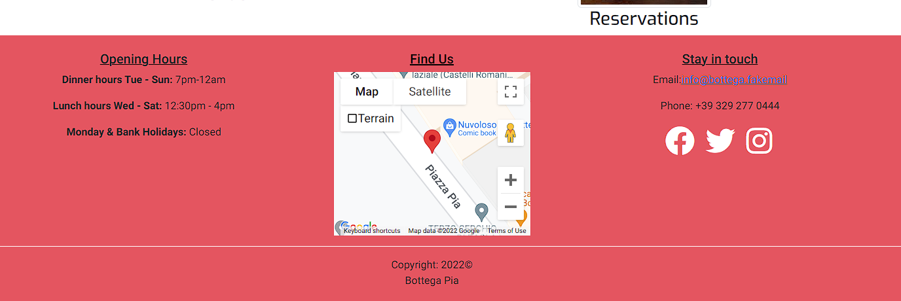

# Manual Testing

## Epic 1 - Core website functionality
The homepage instanlty provides the user with all information needed to be able to navigate through the website & to gain an understanding of 'who' the restaurant is.

The navbar is self explanatory and it is also clear to the user which page they are currently on.

The footer provides all additional key information required, opening times, location and contact information. For users viewing on a larger screen an embedded google map is included. 

Upon submitting the contact form the user is given a postive message to confirm that is has been sent to the website owner and an email is received with the information from the form.

## Epic 2 - Admin functionality

Admin Login
Menus can be updated
Food and drinks items have CRUD
Approve/reject reservation requests
Using a specified login the site owner can access the admin backend
Once in this admin backend, the admin user is able to access the food and drinks item model, add new items or edit/delete existing one and toggle with 'on menu' which will change which items are displayed on the 'live' menu pages respectively.

## Epic 3 - User Authentication

Users can login
Logged in status clear to user
Prompt user to register
Forms pre-populated for users

## Epic 4 - Menus can be viewed
Food and drinks menus displayed seperately
All items on the menu have a price, description and dietary info

## Epic 5 - Reservations Functionality

Users can submit a reservation enquiry
Reservation is rejected if restaurant is fully booked
Reservations can be edited by the user on the front end
Users can edit their information

I have written a small number of JS functions that handle some animation & event listeners to add classes and attributes to elements created dynamically.

**`screenSize()`** - hides/shows the map section of the footer depending on the size of the window. If smaller than 994 it remains hidden:

 

And any larger than that it appears:

I have used this function when a window resizes in conjunction with a `debounce` function to prevent the function triggering if being called continuously. It triggers after it has stopped being called for 150 milliseconds. As explained [here](https://davidwalsh.name/javascript-debounce-function).

However screenSize is called whenever the document is loaded to prevent the map showing when a user navigates through the site.